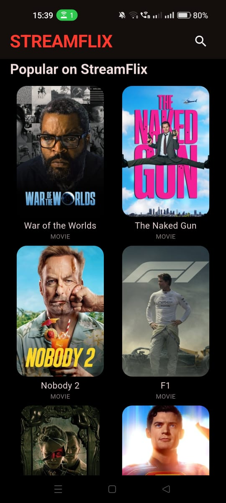
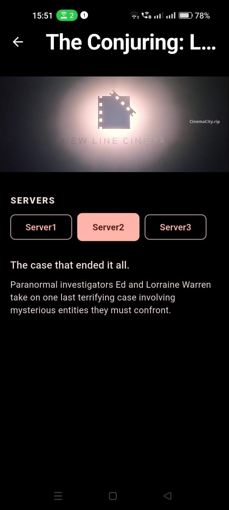

# 🎬 StreamFlix

<div align="center">
  
  
  
  
  
  
  
  
</div>

<br>

<div align="center">
  <h3>🚀 A modern, cross-platform streaming application built with Flutter</h3>
  <p>Experience your favorite movies and TV shows with a beautiful, Netflix-inspired interface across all your devices.</p>
</div>

<div align="center">

[](https://opensource.org/licenses/MIT)
[](https://flutter.dev/)
[](CONTRIBUTING.md)
[](https://github.com/yourusername/streamflix/issues)
[](https://github.com/yourusername/streamflix/stargazers)

</div>

---

## 📋 Table of Contents

- [✨ Features](#-features)
- [🖼️ Screenshots](#️-screenshots)
- [🚀 Quick Start](#-quick-start)
- [📱 Platform Support](#-platform-support)
- [🏗️ Architecture](#️-architecture)
- [🔧 Technologies](#-technologies)
- [⚙️ Configuration](#️-configuration)
- [🧪 Testing](#-testing)
- [🚀 Deployment](#-deployment)
- [🤝 Contributing](#-contributing)
- [🔒 Security](#-security)
- [📄 License](#-license)
- [👥 Community](#-community)

---

## ✨ Features

### 🎯 Core Features
- **🎥 HD Streaming**: High-quality video playback with adaptive bitrate streaming
- **🔍 Smart Search**: Advanced search, and real-time results
- **📚 Content Discovery**: trending content
- **📱 Responsive Design**: Seamless experience across all screen sizes

### 🎨 User Experience
- **🌙 Dynamic Theming**: Auto dark/light mode with custom theme options
- **🎮 Advanced Player**: playback speed control

### 🔧 Technical Features
- **⚡ Performance**: Optimized rendering with 60+ FPS animations
- **🔄 State Management**: Efficient state management with Provider/Riverpod
- **🌍 Accessibility**: Full screen reader support and keyboard navigation
- **🔐 Security**: Secure authentication and encrypted streaming
- **📊 Analytics**: Built-in analytics and crash reporting

---

## 🖼️ Screenshots

<div align="center">
  <table>
    <tr>
      <td align="center">
        
        <br><b>📱 Mobile Home</b>
      </td>
      <td align="center">
        
        <br><b>🔍 Smart Search</b>
      </td>
      <td align="center">
        
        <br><b>🎥 Video Player</b>
      </td>
    </tr>
  </table>
</div>

---

## 🚀 Quick Start

### 📋 Prerequisites

Before you begin, ensure you have the following installed:

- **Flutter SDK**: `>= 3.19.0` ([Install Flutter](https://docs.flutter.dev/get-started/install))
- **Dart SDK**: `>= 3.3.0` (included with Flutter)
- **Git**: For version control
- **IDE**: VS Code or Android Studio with Flutter extensions

#### Platform-specific requirements:
- **Android**: Android Studio, Android SDK (API 24+)
- **iOS**: Xcode 15+ (macOS only)
- **Web**: Chrome 94+ for development
- **Desktop**: Platform-specific development tools

### ⚡ Installation

1. **Clone the repository**
   ```bash
   git clone https://github.com/yourusername/streamflix.git
   cd streamflix
   ```

2. **Install dependencies**
   ```bash
   flutter pub get
   ```

3. **Set up environment variables**
   ```bash
   cp .env.example .env
   # Edit .env with your API keys and configuration
   ```

4. **Run the application**
   ```bash
   # For development
   flutter run
   
   # For specific platform
   flutter run -d chrome        # Web
   flutter run -d android       # Android
   flutter run -d ios           # iOS
   flutter run -d windows       # Windows
   flutter run -d macos         # macOS
   flutter run -d linux         # Linux
   ```

### 🔑 API Configuration

1. Get your API keys:
   - [TMDB API Key](https://www.themoviedb.org/settings/api)
   - [Streaming Service API](your-streaming-service-url)

2. Create `.env` file:
   ```env
   TMDB_API_KEY=your_tmdb_api_key_here
   STREAM_API_URL=your_streaming_api_url
   ENABLE_ANALYTICS=true
   DEBUG_MODE=false
   ```

---

## 📱 Platform Support

<div align="center">
  <table>
    <tr>
      <th>Platform</th>
      <th>Minimum Version</th>
      <th>Status</th>
      <th>Features</th>
    </tr>
    <tr>
      <td>🤖 Android</td>
      <td>API 24 (Android 7.0)</td>
      <td>✅ Stable</td>
      <td>Full feature set</td>
    </tr>
    <tr>
      <td>🍎 iOS</td>
      <td>iOS 12.0</td>
      <td>✅ Stable</td>
      <td>Full feature set</td>
    </tr>
    <tr>
      <td>🌐 Web</td>
      <td>Chrome 94+, Firefox 90+, Safari 14+</td>
      <td>✅ Stable</td>
      <td>Limited offline support</td>
    </tr>
    <tr>
      <td>🖥️ Windows</td>
      <td>Windows 10 1903+</td>
      <td>✅ Stable</td>
      <td>Full feature set</td>
    </tr>
    <tr>
      <td>🖥️ macOS</td>
      <td>macOS 10.15+</td>
      <td>✅ Stable</td>
      <td>Full feature set</td>
    </tr>
    <tr>
      <td>🐧 Linux</td>
      <td>Ubuntu 20.04+</td>
      <td>🧪 Beta</td>
      <td>Core features</td>
    </tr>
  </table>
</div>

---

## 🏗️ Architecture

StreamFlix follows **Clean Architecture** principles with a feature-first approach:

```
lib/
├── 🎯 core/                    # Core utilities and base classes
│   ├── constants/             # App constants and configurations
│   ├── errors/                # Error handling and exceptions
│   ├── network/               # Network layer and HTTP client
│   ├── storage/               # Local storage and caching
│   └── utils/                 # Helper functions and utilities
│
├── 🎨 presentation/           # UI Layer
│   ├── pages/                 # Application screens
│   ├── widgets/               # Reusable UI components
│   ├── providers/             # State management
│   └── themes/                # App themes and styling
│
├── 💼 domain/                 # Business Logic Layer
│   ├── entities/              # Core business entities
│   ├── repositories/          # Repository interfaces
│   └── usecases/              # Business use cases
│
├── 🔧 data/                   # Data Layer
│   ├── datasources/           # Remote and local data sources
│   ├── models/                # Data models and DTOs
│   └── repositories/          # Repository implementations
│
├── 🚀 features/               # Feature modules
│   ├── authentication/        # User authentication
│   ├── content_discovery/     # Content browsing and search
│   ├── video_player/          # Video playback
│   ├── downloads/             # Offline content
│   └── user_profile/          # User management
│
└── main.dart                  # Application entry point
```

### 🎯 Key Architectural Principles

- **🔄 Dependency Injection**: Using `get_it` for clean dependency management
- **📱 State Management**: Riverpod for reactive state management
- **🌐 Repository Pattern**: Clean separation of data sources
- **🧪 Testable Code**: High test coverage with unit and widget tests
- **🔧 SOLID Principles**: Maintainable and extensible codebase

---

## 🔧 Technologies

### 🎨 Frontend
```yaml
flutter_sdk: ">=3.19.0 <4.0.0"
dart_sdk: ">=3.3.0 <4.0.0"
```

### 📦 Key Dependencies

#### 🎥 Media & Video
- **video_player**: `^2.8.2` - Core video playback
- **chewie**: `^1.7.5` - Enhanced video player
- **cached_network_image**: `^3.3.1` - Image caching

#### 🌐 Networking & API
- **dio**: `^5.4.0` - HTTP client with interceptors
- **retrofit**: `^4.0.3` - Type-safe API client
- **json_annotation**: `^4.8.1` - JSON serialization

#### 🔄 State Management
- **riverpod**: `^2.4.9` - Reactive state management
- **flutter_riverpod**: `^2.4.9` - Flutter integration

#### 🗄️ Storage & Database
- **hive**: `^2.2.3` - Lightweight database
- **shared_preferences**: `^2.2.2` - Simple key-value storage

#### 🎨 UI & Animation
- **flutter_animate**: `^4.5.0` - Advanced animations
- **shimmer**: `^3.0.0` - Loading animations
- **flutter_staggered_grid_view**: `^0.7.0` - Grid layouts

### 🧪 Development Dependencies
- **flutter_test**: Testing framework
- **mockito**: `^5.4.4` - Mocking for tests
- **flutter_launcher_icons**: `^0.13.1` - App icons
- **flutter_lints**: `^3.0.1` - Linting rules

---

## ⚙️ Configuration

### 🛠️ Environment Setup

Create environment-specific configuration files:

```yaml
# config/dev.yaml
api:
  base_url: "https://api-dev.streamflix.com"
  tmdb_url: "https://api.themoviedb.org/3"
  timeout: 30000

features:
  analytics: false
  crash_reporting: true
  debug_mode: true

# config/prod.yaml
api:
  base_url: "https://api.streamflix.com"
  tmdb_url: "https://api.themoviedb.org/3"
  timeout: 15000

features:
  analytics: true
  crash_reporting: true
  debug_mode: false
```

### 🔐 Security Configuration

```dart
// lib/core/config/security_config.dart
class SecurityConfig {
  static const bool enableSSLPinning = true;
  static const bool enableEncryption = true;
  static const Duration tokenRefreshThreshold = Duration(minutes: 5);
  
  // Certificate pinning for production
  static const List<String> pinnedCertificates = [
    'sha256/AAAAAAAAAAAAAAAAAAAAAAAAAAAAAAAAAAAAAAAAAAA=',
  ];
}
```

---

## 🧪 Testing

### 🏃‍♂️ Running Tests

```bash
# Run all tests
flutter test

# Run tests with coverage
flutter test --coverage

# Run integration tests
flutter test integration_test/

# Run specific test file
flutter test test/features/authentication/login_test.dart
```

### 📊 Test Coverage

We maintain **90%+** test coverage across:

- **Unit Tests**: Business logic and utilities
- **Widget Tests**: UI components and interactions
- **Integration Tests**: End-to-end user flows
- **Golden Tests**: Visual regression testing

```bash
# Generate coverage report
genhtml coverage/lcov.info -o coverage/html
open coverage/html/index.html
```

### 🧪 Testing Structure

```
test/
├── unit/                     # Unit tests
│   ├── core/
│   ├── data/
│   └── domain/
├── widget/                   # Widget tests
│   └── presentation/
├── integration/              # Integration tests
│   └── app_test.dart
├── fixtures/                 # Test data
└── helpers/                  # Test utilities
```

---

## 🚀 Deployment

### 📱 Mobile Deployment

#### Android
```bash
# Build release APK
flutter build apk --release --target-platform android-arm64

# Build App Bundle for Play Store
flutter build appbundle --release

# Build for multiple architectures
flutter build apk --release --split-per-abi
```

#### iOS
```bash
# Build for iOS
flutter build ios --release --no-codesign

# Build IPA for App Store
flutter build ipa --release
```

### 🌐 Web Deployment

```bash
# Build for web
flutter build web --release --web-renderer html

# Build with canvas kit (better performance)
flutter build web --release --web-renderer canvaskit

# Deploy to Firebase Hosting
firebase deploy --only hosting
```

### 🖥️ Desktop Deployment

```bash
# Windows
flutter build windows --release

# macOS
flutter build macos --release

# Linux
flutter build linux --release
```

### 🐳 Docker Deployment

```dockerfile
# Dockerfile
FROM nginx:alpine
COPY build/web /usr/share/nginx/html
COPY nginx.conf /etc/nginx/nginx.conf
EXPOSE 80
CMD ["nginx", "-g", "daemon off;"]
```

### ☁️ Cloud Deployment

#### Firebase Hosting
```yaml
# firebase.json
{
  "hosting": {
    "public": "build/web",
    "ignore": ["firebase.json", "**/.*", "**/node_modules/**"],
    "rewrites": [
      {
        "source": "**",
        "destination": "/index.html"
      }
    ]
  }
}
```

#### Vercel
```json
{
  "github": {
    "silent": true
  },
  "builds": [
    {
      "src": "build/web/**",
      "use": "@vercel/static"
    }
  ],
  "routes": [
    {
      "src": "/(.*)",
      "dest": "/index.html"
    }
  ]
}
```

---

## 🤝 Contributing

We welcome contributions! Please see our [Contributing Guide](CONTRIBUTING.md) for details.

### 🚀 Quick Contribution Steps

1. **Fork the repository**
2. **Create a feature branch**
   ```bash
   git checkout -b feature/amazing-feature
   ```
3. **Make your changes**
4. **Add tests** for new functionality
5. **Run tests and linting**
   ```bash
   flutter test
   flutter analyze
   ```
6. **Commit your changes**
   ```bash
   git commit -m 'feat: Add amazing feature'
   ```
7. **Push and create a Pull Request**

### 📝 Commit Convention

We follow [Conventional Commits](https://www.conventionalcommits.org/):

- `feat:` New features
- `fix:` Bug fixes
- `docs:` Documentation changes
- `style:` Code formatting
- `refactor:` Code refactoring
- `test:` Adding tests
- `chore:` Maintenance tasks

### 🏆 Top Contributors

<div align="center">
  <a href="https://github.com/yourusername/streamflix/graphs/contributors">
    
  </a>
</div>

---

## 🔒 Security

### 🛡️ Security Measures

- **🔐 SSL Certificate Pinning**: Prevents man-in-the-middle attacks
- **🔒 Encrypted Storage**: All sensitive data encrypted at rest
- **🔑 Secure Authentication**: JWT tokens with refresh mechanism
- **🚫 Content Protection**: DRM and watermarking support
- **📊 Security Analytics**: Monitor and detect suspicious activities

### 🐛 Reporting Security Issues

Please report security vulnerabilities to: **security@streamflix.com**

### 🔍 Security Audits

- **Dependency Scanning**: Automated vulnerability detection
- **Code Analysis**: Static security analysis with SonarQube
- **Penetration Testing**: Regular third-party security audits

---

## 🗺️ Roadmap

### 🎯 Version 2.1.0 (Current)
- ✅ Multi-language subtitle support
- ✅ Picture-in-picture mode
- ✅ Enhanced search filters
- ✅ Performance optimizations

### 🚀 Version 2.2.0 (Next Quarter)
- 🔄 AI-powered recommendations
- 🎮 Chromecast integration
- 📱 Widget support for home screen
- 🌟 Social features (watch parties)

### 🌟 Version 3.0.0 (2024)
- 🎨 Complete UI redesign
- 🔊 Spatial audio support
- 📺 Live streaming capabilities
- 🤖 Voice control integration

---


## 📄 License

This project is licensed under the **MIT License** - see the [LICENSE](LICENSE) file for details.

```
MIT License

Copyright (c) 2024 StreamFlix Contributors

Permission is hereby granted, free of charge, to any person obtaining a copy
of this software and associated documentation files (the "Software"), to deal
in the Software without restriction...
```

---

## 👥 Community

### 💬 Get Support

- 🐛 **Bug Reports**: [GitHub Issues](https://github.com/Shashwat-CODING/streamflix/issues)
- 💡 **Feature Requests**: [GitHub Discussions](https://github.com/Shashwat-CODING/streamflix/discussions)
- 📧 **Email**: scoder120@gmail.com

### 🌟 Show Your Support

If you like this project, please ⭐ star it on GitHub and share it with your friends!


---

## 🙏 Acknowledgments

Special thanks to all the amazing projects and people that made StreamFlix possible:

- 🎯 **[Flutter Team](https://flutter.dev/)** - For the incredible framework
- 🎬 **[TMDB](https://www.themoviedb.org/)** - For comprehensive movie/TV data
- 🎥 **[Chewie](https://pub.dev/packages/chewie)** - For the excellent video player
- 🎨 **[Material Design](https://material.io/)** - For design inspiration
- 👥 **[Contributors](https://github.com/yourusername/streamflix/graphs/contributors)** - For making this project better
- ⭐ **[Stargazers](https://github.com/yourusername/streamflix/stargazers)** - For your support

---

<div align="center">
  <h3>🚀 Built with ❤️ and Flutter</h3>
  <p>
    <a href="https://flutter.dev">
      
    </a>
  </p>
  
  <p>
    <strong>StreamFlix - Your Entertainment, Everywhere</strong>
  </p>
  
  <p>
    <a href="#-table-of-contents">⬆️ Back to Top</a>
  </p>
</div>
