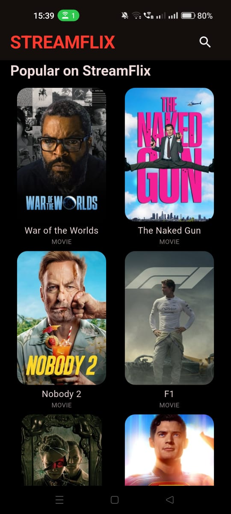
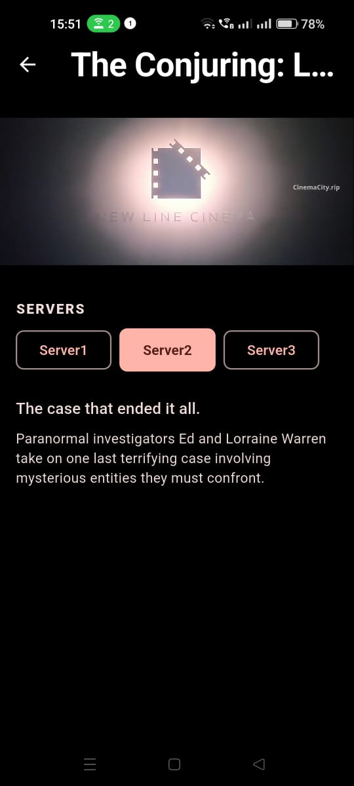
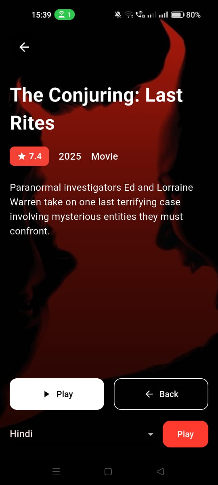

<p align="center">
  
  <h1 align="center">Drishya</h1>
  <p align="center"><b>Cinematic Excellence. Everywhere.</b></p>
  <p align="center">Your ultimate all-in-one streaming hub for Movies, TV Shows, Anime, Live TV, and Mini Games.</p>
</p>

<p align="center">
  
  
  
</p>

---

Drishya is a premium, cross-platform streaming application built with Flutter, designed to provide a high-end cinematic experience. It features a modern Liquid Glass UI, high-performance playback engines, and a comprehensive library of content including movies, series, IPTV, and interactive mini-games.

## ✨ Key Features

- 🎬 **Movies & TV Shows**: Extensive library with deep metadata, cast details, and recommendations.
- 📺 **Live TV (IPTV)**: Global IPTV integration with country-wise and category-wise browsing.
- 🎮 **Mini Games**: Built-in library of web-based "Playables" for instant gaming.
- 📥 **Advanced Downloads**: Resumable, high-speed downloads with background support and automatic source fallback.
- 🎨 **Liquid Glass UI**: Stunning aesthetics using glassmorphism, Material 3, and dynamic color theming (Android 12+).
- ⚡ **Premium Playback**: Dual engine support (FVP/VLC & Video Player) with hardware acceleration.
- 🔍 **Smart Search**: Global search functionality across all media types.
- 🕒 **Sync & History**: Persistent watch history, bookmarks, and deep-linking support.
- 🚀 **Cross-Platform**: Optimized for Android (Mobile), Windows (Desktop), and Web.

## 🛠 Tech Stack

- **Framework**: [Flutter](https://flutter.dev) (v3.11+)
- **Engines**: 
  - [fvp](https://pub.dev/packages/fvp) (High-performance FFmpeg-based playback)
  - [video_player](https://pub.dev/packages/video_player)
- **UI/UX**:
  - Material 3 & [dynamic_color](https://pub.dev/packages/dynamic_color)
  - [flutter_animate](https://pub.dev/packages/flutter_animate) (Stunning micro-animations)
  - [google_fonts](https://pub.dev/packages/google_fonts) (DM Sans & DM Serif Display)
- **Services**:
  - [dio](https://pub.dev/packages/dio) (Advanced HTTP client for downloads)
  - [shared_preferences](https://pub.dev/packages/shared_preferences) (Local persistence)
  - [app_links](https://pub.dev/packages/app_links) (Deep linking & protocol registration)
  - [window_manager](https://pub.dev/packages/window_manager) (Desktop window control)
  - [media_store_plus](https://pub.dev/packages/media_store_plus) (Android public storage access)

## 📸 Screenshots

<p align="center">
  
  
  
  
</p>

## 🚀 Getting Started

### Prerequisites
- Flutter SDK (latest stable version)
- Android Studio / VS Code
- A physical device or emulator

### Installation
1. Clone the repository:
   ```bash
   git clone https://github.com/Shashwat-CODING/Drishya.git
   ```
2. Install dependencies:
   ```bash
   flutter pub get
   ```
3. Run the application:
   ```bash
   flutter run
   ```

## 📜 License
Distributed under the MIT License.

---
<p align="center">Built with ❤️ by the Drishya Team</p>
